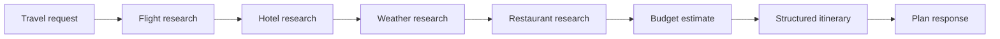
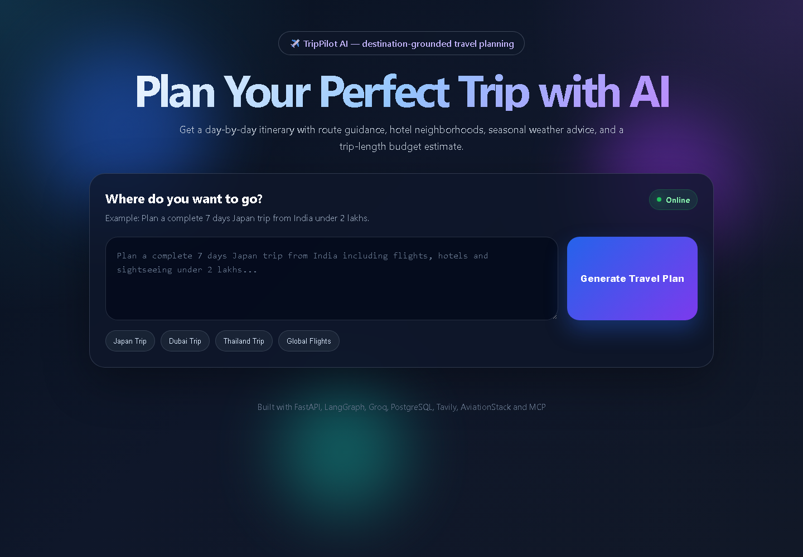
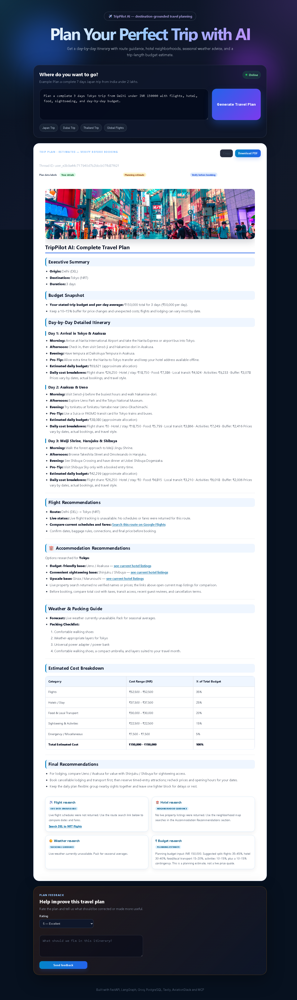

# TripPilot AI

A travel-planning demo that turns a natural-language trip request into a structured, day-by-day itinerary. It combines a LangGraph workflow with FastAPI, a small browser UI, and optional external research providers.

[Live demo](https://tripmate-ai-multi-agent-travel-planner-5.onrender.com/)

## What it does

- Accepts requests such as `Plan a 5-day Tokyo trip from Delhi under INR 200000`.
- Runs a sequential research workflow for flights, stays, weather, restaurants, and budget, then builds a structured itinerary.
- Produces morning, afternoon, evening, and practical tips for each requested day.
- Shows a trip budget snapshot, category breakdown, and indicative day-by-day allocations.
- Falls back to route-search and map links when live providers do not return results.
- Saves user-submitted plan feedback to a local JSONL file.

## Architecture



`backend.py` contains the LangGraph state and agents. `app.py` exposes the FastAPI endpoints. The weather module is an adapter used by the weather agent; it also includes an MCP server entry point for experimentation.

## Data and estimate notes

| Section | Source and behavior |
| --- | --- |
| Flights | AviationStack flight-tracking data when configured and available. It does not provide ticket fares. If tracking results are unavailable, the plan links to a route search on Google Flights. |
| Accommodation | Tavily web search when configured and reachable. When it returns no property results, the plan provides destination-area map searches; these are not verified hotel endorsements. |
| Weather | OpenWeather data through the weather adapter when configured and reachable; otherwise a seasonal fallback is shown. |
| Budget | A planning estimate derived from the request or currency/day defaults and allocated across expense categories. It is not a quote and can vary by dates, party size, and booking choices. |
| Itinerary | Structured LLM output with destination-grounded fallback days when the model is unavailable. Check opening hours, transit, and venue details before travel. |

The app does not book flights or hotels. Live results depend on API credentials, provider coverage, and network access.

## Quick start (Windows PowerShell)

```powershell
python -m venv .venv
.venv\Scripts\Activate.ps1
python -m pip install -r requirements.txt
if (-not (Test-Path .env)) { Copy-Item .env.example .env }
```

Add the API keys you have to `.env`. The app can start without optional providers, but related sections will use fallbacks.

```dotenv
GROQ_API_KEY=
GROQ_MODEL=openai/gpt-oss-20b
TAVILY_API_KEY=
AVIATIONSTACK_API_KEY=
OPENWEATHER_API_KEY=
DATABASE_URL=
DEFAULT_ORIGIN_IATA=DEL
```

Run the app from the project directory:

```powershell
python -m uvicorn app:app --reload --host 127.0.0.1 --port 8003
```

Open [http://127.0.0.1:8003](http://127.0.0.1:8003). The `/health` endpoint reports the active planner build. Without `DATABASE_URL`, LangGraph uses in-memory checkpointing; state is lost when the process stops.

## API

### `POST /api/travel`

Request:

```json
{
  "message": "Plan a 5-day Tokyo trip from Delhi under INR 200000"
}
```

Returns the generated answer, research fields, itinerary data, and build ID.

### `POST /api/feedback`

Stores a 1–5 rating and feedback message in `feedback.jsonl`.

### `GET /health`

Returns service status and the planner build ID.

`POST /api/travel/approve` is not implemented in this version and returns HTTP 409. The current planner does not have a human approval workflow.

## Screenshots and demo

These screenshots were captured from the local app, not generated mockups:

| Request screen | Generated itinerary |
| --- | --- |
|  |  |

The itinerary capture includes provider results available during that run. Flight tracking is not a fare quote, and hotel listings can change or be unavailable on another run.

[Watch the 57-second recruiter demo](docs/trippilot-recruiter-demo.mp4) (silent video with on-screen captions).

## Offline checks

Run the deterministic planning-helper checks without connecting to PostgreSQL or external providers:

```powershell
$env:DATABASE_URL = ""
python -m unittest discover -s tests -v
```

## Project structure

| Path | Purpose |
| --- | --- |
| `app.py` | FastAPI routes and response sanitization |
| `backend.py` | LangGraph agents, itinerary synthesis, destination data, and estimates |
| `tools/flight_tool.py` | AviationStack route/flight tracking adapter |
| `tools/tavily_tool.py` | Tavily web-search adapter |
| `custom_weather_mcp_server.py` | OpenWeather adapter and MCP server entry point |
| `templates/`, `static/` | Browser UI and rendering |
| `docs/screenshots/` | Screenshots of the request, progress, and itinerary UI |

## Recruiter demo notes

Try one request with an explicit origin, destination, duration, and budget. Show the structured itinerary and explain which sections use provider data versus estimates. Do not present generated budget allocations, search links, or flight tracking as confirmed fares or reservations. No benchmark or accuracy metrics are published because this repository does not currently include a measured evaluation set.
